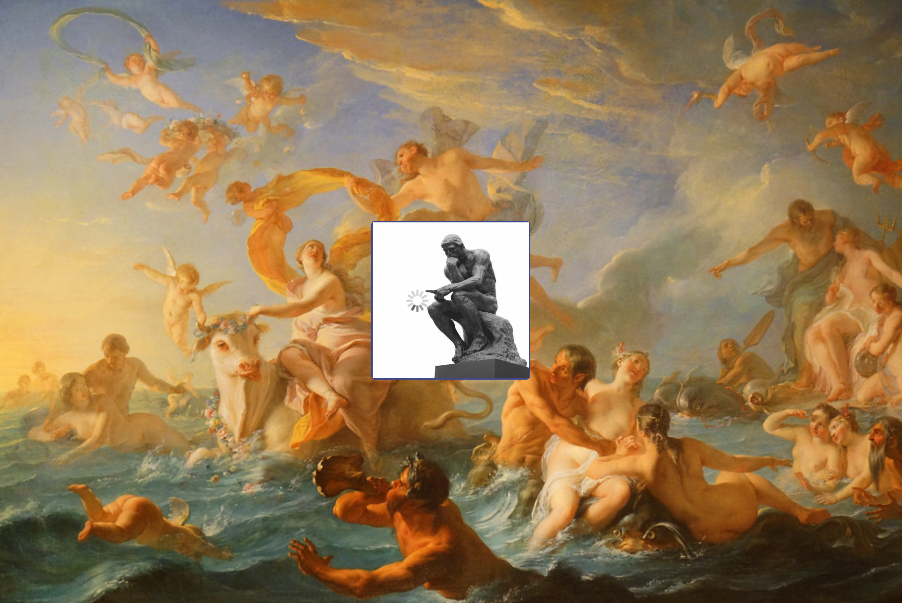
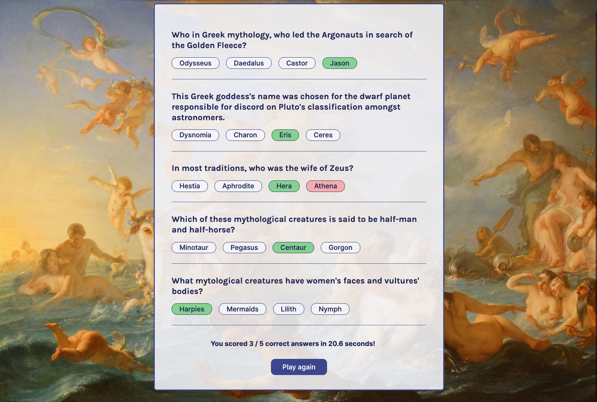
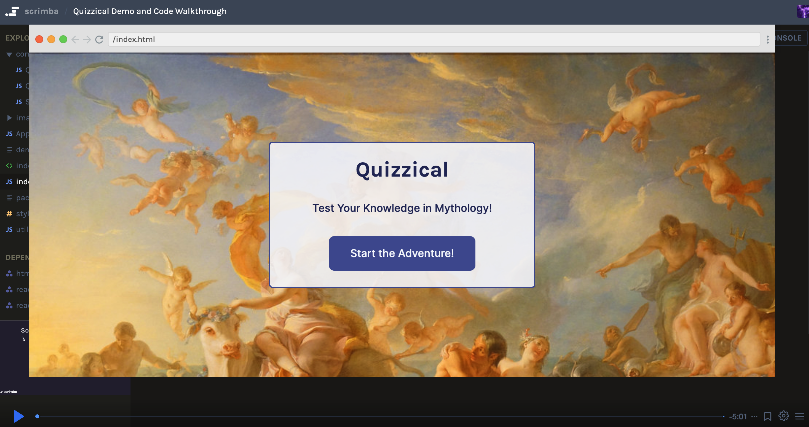

# Quizzical
A trivia app that tests your knowledge in mythology. The UI is built with React and fetches fresh mythology trivia questions and answers data from the Open Trivia Database API.

## In This Document:
1. [Application URL](#application-url)
2. [Demo and Code Walkthrough](#demo-and-code-walkthrough)
3. [How to Use the Application](#how-to-use-the-application)
4. [Technologies Used](#technologies-used)
5. [Future Feature Sets](#future-feature-sets)
6. [Stumbling and Learning Points](#stumbling-and-learning-points)

## Application URL
https://quizzical-shant.netlify.app/

## Demo and Code Walkthrough

## How to Use the Application
* Player browses to the app's welcome page
* App displays 5 trivia questions with 4 multiple choice answers
* Players clicks on the answer to each questions
* Player clicks on Check Answers
* Correct answers should get highlighted, and a total score and time taken to answer should display
* PLayer can click on Play Again to restrat the game 

## Technologies Used
* React.js
* OTDB API 

## Future Feature Sets:
* Enable the player to choose the number of questions and the level of difficulty.

## Stumbling and Learning Points:
* Learning how to delay the loading image at least a set amount of time, in addition to the delay it takes to load the data.
  

[Up](README.md)
