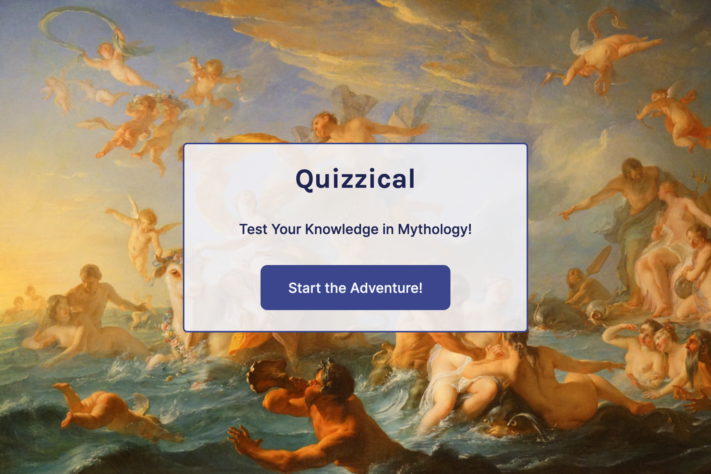
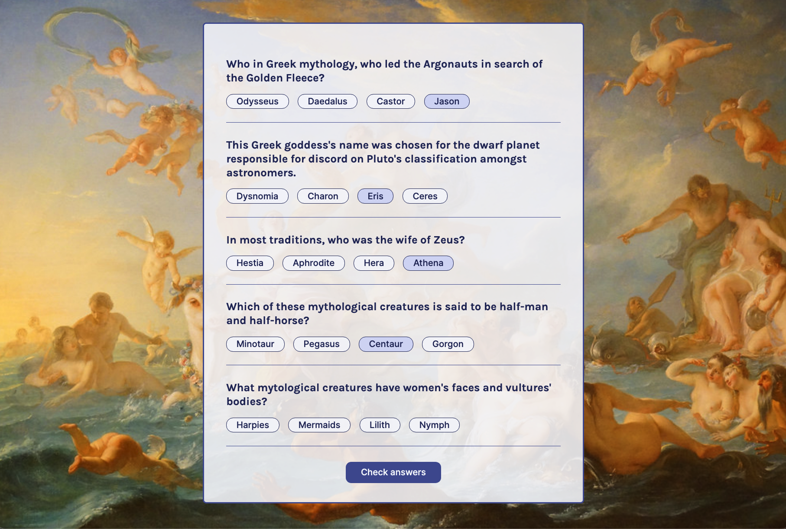

# Quizzical
A trivia app that tests your knowledge in mythology. The UI is built with React and fetches fresh mythology trivia questions and answers data from the Open Trivia Database API.







## In This Document:
1. [Application URL](#application-url)
2. [Demo and Code Walkthrough](#demo-and-code-walkthrough)
3. [How to Use the Application](#how-to-use-the-application)
4. [Technologies Used](#technologies-used)
5. [Future Feature Sets](#future-feature-sets)
6. [Stumbling and Learning Points](#stumbling-and-learning-points)

## Application URL
https://quizzical-shant.netlify.app/

## Demo and Code Walkthrough
[](https://scrimba.com/scrim/co45f42ffa92703ad5b730469)

## How to Use the Application
1. Player browses to the app's welcome page.
1. App displays 5 trivia questions each with 4 multiple choice answers.
1. Player clicks on the answer to each questions.
1. Player clicks on Check Answers.
1. Correct answers should get highlighted, and a total score and time taken to answer should display.
1. Player can click on Play Again to restart the game. 

## Technologies Used
1. [React.js](https://react.dev/)
1. [Open Trivia Database API](https://opentdb.com/) 

## Future Feature Sets:
1. Enable the player to choose the number of questions and the level of difficulty.
1. Enable the player to choose questions category and change the app theme accordingly.

## Stumbling and Learning Points:
* Figuring out how to display the loading image at least for a set amount of time, and at most for the time it takes to load the data.
```
const elapsedTime = Date.now() - startTime;
const delay = Math.max(minQuestionsLoadingDelay - elapsedTime, 0);
```
<hr>

[Up](README.md)
